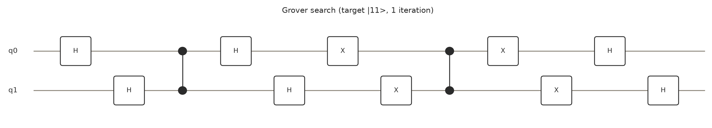

# blueqat-mcp-playground

[blueqat MCP](https://github.com/blueqat/blueqatSDK) サーバーで遊んでみたメモと使用例集です。
MCP (Model Context Protocol) 経由で量子回路シミュレータ・QAOA・VQE・実機QPUを呼び出せる `blueqat` サーバーの
ツールを一通り叩き、実際に返ってきた結果を添えてドキュメント化しています。

すべての実行結果には `run_id` が付いており、[verify_run](https://mcp.blueqat.app) で本当に実行されたことを検証できます。
このリポジトリの例に載せた `run_id` もすべて実際にサーバー上で実行したものです（結果を手で書き換えていません）。

<p align="center">
  
</p>

## これは何か

blueqat MCP は、JSON形式のゲートリストで量子回路を記述して投げると、クラウド上のシミュレータ(または実機QPU)で
実行してくれる MCP サーバーです。Claude Code / Claude Desktop など MCP 対応クライアントから、SDKのインストールや
Pythonの実行環境なしに量子計算を試せます。

- 回路シミュレーション（counts / amplitude / statevector / expectation）
- QAOA によるQUBO最適化
- VQE による基底エネルギー探索
- 回路図の描画・ゲート数/深さの確認
- 実機QPU（OQC Toshiko Tokyo-1 など）への投入

## クイックスタート

MCPクライアント（Claude Codeなど）から `run_circuit` ツールを、以下のようなJSONで呼び出します。

```json
{
  "gates": [
    {"gate": "h", "qubits": [0]},
    {"gate": "cx", "qubits": [0, 1]}
  ],
  "shots": 256,
  "output": "counts"
}
```

ゲート名の一覧は `list_gates` ツールで取得できます（`docs/gates.md` に一覧を転記済み）。

初めての人は先に [docs/basics.md](docs/basics.md)（量子コンピューティングの基礎）を読むと、以下の例が
理解しやすくなります。「結局何の役に立つの？」という人は [docs/applications.md](docs/applications.md)
（実生活での応用イメージ）へ。

（業務での採用を検討している場合は [docs/when_to_use_quantum.md](docs/when_to_use_quantum.md)
「量子より枯れた技術のほうが優れているかもしれない話」も）

## 使用例一覧

| # | 例 | 使ったツール | 内容 |
|---|----|-------------|------|
| 1 | [ベル状態](examples/01_bell_state.md) | `run_circuit` | 2量子ビットの最小のエンタングルメント例。counts / statevector / amplitude の3通りの出力を比較 |
| 2 | [GHZ状態](examples/02_ghz_state.md) | `run_circuit`, `circuit_info`, `draw_circuit` | 3量子ビットへの拡張、回路情報の取得と回路図の描画 |
| 3 | [Grover探索](examples/03_grover_search.md) | `run_circuit`, `draw_circuit` | 2量子ビット・1反復のGroverアルゴリズムで100%正解を引く |
| 4 | [QAOAでMaxCut](examples/04_qaoa_maxcut.md) | `run_qaoa` | 三角形グラフの最大カット問題をQUBOとして解く |
| 5 | [VQEで横磁場イジング模型](examples/05_vqe_transverse_ising.md) | `run_vqe` | 2量子ビットの横磁場イジング模型の基底エネルギーを変分法で求める |
| 6 | [量子乱数生成](examples/06_quantum_random_number_generator.md) | `run_circuit` | 棄却サンプリングで公正な6面サイコロを作る。**実生活**: 抽選・ガチャの公正性証明、暗号鍵生成 |
| 7 | [QAOAで予算ぴったり一致](examples/07_qaoa_budget_matching.md) | `run_qaoa` | 部分和問題をQUBOで解く。**実生活**: 経理の消込、在庫の詰め合わせ |
| 8 | [QAOAで日米株ポートフォリオ選定](examples/08_qaoa_portfolio_jp_us.md) | `run_qaoa` | 実際の日米株価データ(yfinance)からMarkowitz型の銘柄選択QUBOを組み、リスク許容度λを変えて最適組み合わせを比較。**実生活**: 投資判断の計算フレームワーク（投資助言ではありません） |
| 9 | [QAOAでAI学習の特徴量選択](examples/09_qaoa_feature_selection.md) | `run_qaoa` | 乳がん診断データセットでmRMR型（関連度は高く・冗長でない）の特徴量選択QUBOを組み、SelectKBest等の古典手法とテスト精度を正面から比較。**実生活**: AIモデル学習の前処理（次元削減・過学習抑制） |
| 10 | [Grover探索でトイ暗号の鍵を復元](examples/10_grover_key_search.md) | `run_circuit`, `draw_circuit` | 3量子ビット・2反復のGrover探索で3bit鍵（候補8通り）を95.3%の確率で復元。**実生活**: 対称鍵暗号の量子耐性・鍵長設計（実在の暗号への攻撃ではありません） |
| 11 | [BB84量子鍵配送](examples/11_bb84_quantum_key_distribution.md) | `run_circuit` | アンシラ量子ビットで盗聴者Eveを表現し、盗聴の有無でBobの誤り率が0%→約26%（理論値25%）に変わることを確認。**実生活**: 盗聴を物理法則で検知できる高セキュリティ通信（実際の秘密鍵配送には使用できません） |

## 無料枠の制限（free tier）

`sdk_info` ツールで取得した、このアカウントに適用される制限です。

| 項目 | free | paid |
|------|------|------|
| 最大量子ビット数 | 10 | 20 |
| statevector等の最大量子ビット数 | 10 | 16 |
| 最大ショット数 | 256 | 4000 |
| 最大ゲート数 | 200 | 1000 |
| ハミルトニアン最大項数 | 20 | 50 |
| QAOA最大ステップ数(p) | 2 | 5 |
| タイムアウト | 10秒 | 20秒 |
| 実機ジョブ/月 | 10 | 100 |

詳細は [docs/tiers_and_pricing.md](docs/tiers_and_pricing.md) を参照してください。

## 実機QPU

`list_hardware_qpus` で取得できる、このサーバーから投入可能な実機/エミュレータです。詳細は [docs/hardware.md](docs/hardware.md)。

- **OQC Toshiko Tokyo-1**（日本リージョン、32量子ビット、実機）
- **Lucy Simulator**（英国リージョン、8量子ビット、常時稼働のホステッドシミュレータ）

## AIエージェント向けスキル

このリポジトリを作る過程で得た知見は、Claude Code をはじめとする AI エージェントが直接扱えるよう
`skills/` 以下に**スキル**としてもまとめています。

- [`github-markdown-math-rendering`](skills/github-markdown-math-rendering/SKILL.md) — GitHubのMarkdown上で
  LaTeX数式（$...$ / $$...$$）を書くときの、GitHub側MathJaxレンダラー特有の落とし穴と直し方
- [`using-blueqat-mcp`](skills/using-blueqat-mcp/SKILL.md) — blueqat MCPのツール群をどう使い分けるか、
  実機投入前の安全な確認手順、そして「量子が本当に古典より優れているか」を安易に主張しないための評価軸
  （[docs/when_to_use_quantum.md](docs/when_to_use_quantum.md)の内容をエージェント向けに凝縮したもの）

このリポジトリを clone してそのまま作業する場合は `.claude/skills/` / `.agents/skills/`
（`skills/`へのシンボリックリンク）から自動的に読み込まれます。他のリポジトリ・他の環境から
マーケットプレイス経由で導入することもできます。

```
claude plugin marketplace add Wanyaldee/blueqat-mcp-playground
claude plugin install blueqat-mcp-playground@blueqat-mcp-playground
```

## リポジトリ構成

```
.
├── README.md
├── LICENSE
├── examples/        使用例（実行結果・run_id付き）
├── assets/          回路図・グラフ図のPNG（examplesから参照）
├── scripts/
│   ├── render_diagrams.py             assets/ のPNGを生成するスクリプト
│   ├── fetch_portfolio_data.py        例8用の株価データ取得・QUBO生成スクリプト
│   ├── build_feature_selection_qubo.py 例9用の特徴量選択QUBO生成スクリプト
│   └── build_bb84_circuit.py          例11用のBB84回路生成スクリプト
└── docs/
    ├── basics.md              量子コンピューティングの基礎
    ├── applications.md        実生活での応用イメージ
    ├── gates.md               対応ゲート一覧
    ├── tiers_and_pricing.md   ティア制限と実機課金
    ├── hardware.md            実機QPU一覧
    └── when_to_use_quantum.md 業務採用を検討する人向け（枯れた技術との比較）
```

回路図について: `draw_circuit` ツール自体はPNGをチャット表示用に返すだけで生バイト列として保存できないため、
`assets/` の画像は同じ回路構成を [scripts/render_diagrams.py](scripts/render_diagrams.py)（matplotlib）で
このリポジトリ用に再描画したものです。ゲート列や実行結果はすべてMCPサーバーから実際に返ってきたものをそのまま
使用しています。

## ライセンス

MIT License. 詳細は [LICENSE](LICENSE) を参照してください。
blueqat MCP サーバー自体および `blueqat` SDK 本体は別プロジェクトです（[blueqat/blueqatSDK](https://github.com/blueqat/blueqatSDK)）。
