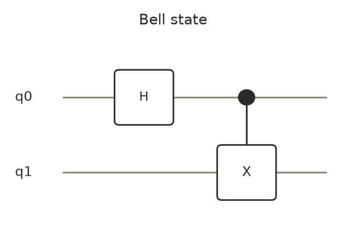

# 例1: ベル状態（2量子ビットの最小エンタングルメント）

最もシンプルな例。H ゲートで重ね合わせを作り、CNOT でエンタングルさせるだけの2量子ビット回路です。
`run_circuit` の3種類の出力形式（counts / statevector / amplitude）を同じ回路に対して試しました。

## 回路



```json
{
  "gates": [
    {"gate": "h", "qubits": [0]},
    {"gate": "cx", "qubits": [0, 1]}
  ]
}
```

## 1. counts（測定を256ショット）

### リクエスト

```json
{
  "gates": [
    {"gate": "h", "qubits": [0]},
    {"gate": "cx", "qubits": [0, 1]}
  ],
  "shots": 256,
  "output": "counts"
}
```

### 結果

```json
{
  "counts": { "11": 122, "00": 134 },
  "shots": 256,
  "bit_order": "bitstring[0] is qubit 0"
}
```

`00` と `11` にほぼ半々で分かれ、`01` `10` が一度も出ないのがエンタングルメントの特徴です。

`proof`: [✓ 実行済み sim_20260827_9a4b6c5c7ee14a40](https://mcp.blueqat.app/runs/sim_20260827_9a4b6c5c7ee14a40)

## 2. statevector

### リクエスト

```json
{
  "gates": [
    {"gate": "h", "qubits": [0]},
    {"gate": "cx", "qubits": [0, 1]}
  ],
  "output": "statevector"
}
```

### 結果

```json
{
  "statevector": [
    {"re": 0.7071067811865475, "im": 0.0},
    {"re": 0.0, "im": 0.0},
    {"re": 0.0, "im": 0.0},
    {"re": 0.7071067811865475, "im": 0.0}
  ],
  "indexing": "statevector[i]: bit k of index i is qubit k (little-endian)"
}
```

`1/√2 (|00⟩ + |11⟩)` がそのまま得られています。振幅 `0.7071...` は `1/√2` です。

`proof`: [✓ 実行済み sim_20260827_077a6a1742ff148a](https://mcp.blueqat.app/runs/sim_20260827_077a6a1742ff148a)

## 3. amplitude（特定の基底状態の振幅だけ取り出す）

### リクエスト

```json
{
  "gates": [
    {"gate": "h", "qubits": [0]},
    {"gate": "cx", "qubits": [0, 1]}
  ],
  "output": "amplitude",
  "amplitude": "00"
}
```

### 結果

```json
{
  "amplitude": { "re": 0.7071067811865475, "im": 0.0 }
}
```

statevectorの先頭要素（`00`）と一致します。全量子ビット数が大きく `statevector` 出力の上限を超える場合でも、
`amplitude` なら特定の基底状態1点だけを安く確認できます。

`proof`: [✓ 実行済み sim_20260827_f64483bb9d605e3b](https://mcp.blueqat.app/runs/sim_20260827_f64483bb9d605e3b)
