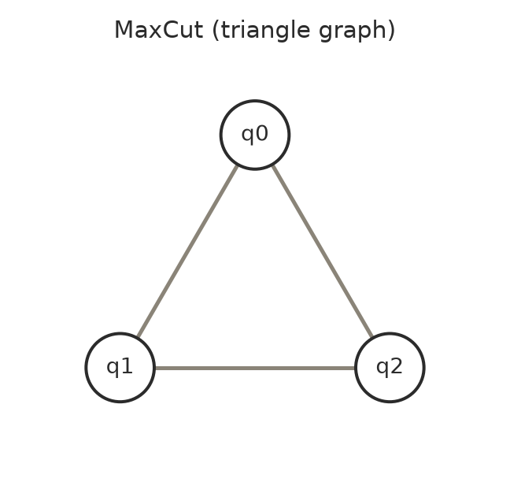

# 例4: QAOAでMaxCut問題を解く

`run_qaoa` は QUBO（0/1変数の二次多項式）を最小化する問題を、QAOA + 古典最適化（実質VQE）で解いて
サンプリングまでしてくれるツールです。ここでは3頂点の完全グラフ（三角形）に対する MaxCut 問題を解きます。

## 問題設定

三角形グラフ（頂点0,1,2、全ての辺がつながっている）の最大カットを求めます。


辺 `(i,j)` を「カットする」= 頂点 i と j を異なる集合に分ける、をQUBOで表すと、1辺あたり

```
minimize:  -q_i - q_j + 2 q_i q_j
```

（`q_i ≠ q_j` のとき値が最小になる）となるので、3辺分を足し合わせます。

```json
{
  "qubo": [
    {"coeff": -2, "qubits": [0]},
    {"coeff": -2, "qubits": [1]},
    {"coeff": -2, "qubits": [2]},
    {"coeff": 2, "qubits": [0, 1]},
    {"coeff": 2, "qubits": [1, 2]},
    {"coeff": 2, "qubits": [0, 2]}
  ],
  "steps": 2,
  "shots": 256,
  "seed": 42,
  "n_starts": 2
}
```

- `steps` (= `p`): QAOAの深さ。free tierの上限は2。
- `n_starts`: 初期パラメータを複数試して一番良い結果を採用。free tierの上限は2
  （最初に `n_starts: 3` で試したところ `CircuitBuildError: n_starts must be an integer between 1 and 2 on the free tier` で弾かれました）。
- `seed`: 指定すると再現可能。省略してもサーバー側が採番して結果に含めてくれます。

## 結果

```json
{
  "mean_value": -2.0,
  "best": { "bitstring": "100", "value": -2.0, "count": 48 },
  "solutions": [
    {"bitstring": "100", "value": -2.0, "count": 48},
    {"bitstring": "001", "value": -2.0, "count": 42},
    {"bitstring": "110", "value": -2.0, "count": 42},
    {"bitstring": "101", "value": -2.0, "count": 42},
    {"bitstring": "010", "value": -2.0, "count": 42},
    {"bitstring": "011", "value": -2.0, "count": 40}
  ]
}
```

三角形の最大カットは理論上「2辺」までしかカットできません（3辺全部をカットする分割は存在しない）。
`000` と `111`（＝全頂点が同じ側 = カット0）を除く6通りの非自明な分割が、すべて理論上の最適値 `-2.0`
（＝カット数2）としてほぼ均等な頻度でサンプリングされており、正しく最適解の縮退（複数の同値最適解）を
捉えられています。

`proof`: [✓ 実行済み sim_20260827_4ee31bea1cf4c38f](https://mcp.blueqat.app/runs/sim_20260827_4ee31bea1cf4c38f)

## QUBOの符号に関する注意

`run_qaoa` は常に**最小化**問題として解きます。MaxCut のように「最大化」したい問題は、
このように符号を反転した式を組み立ててから渡す必要があります。
