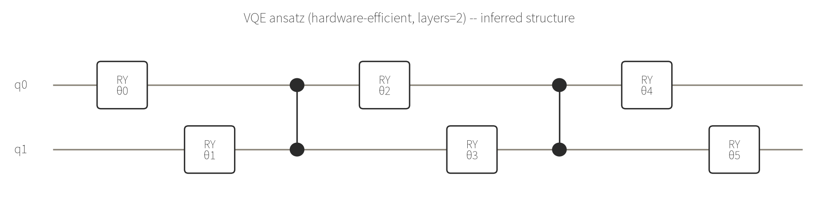

# 例5: VQEで横磁場イジング模型の基底エネルギーを求める

`run_vqe` はハミルトニアンを与えると、ハードウェア効率的アンザッツ（RY回転 + CZチェーン）を使った
変分量子固有値ソルバー(VQE)で基底状態エネルギーを近似計算してくれます。

## ハミルトニアン

2量子ビットの横磁場イジング模型:

$$
H = Z_0 Z_1 - X_0 - X_1
$$

```json
{
  "n_qubits": 2,
  "hamiltonian": [
    {"coeff": 1,  "paulis": [{"op": "Z", "qubit": 0}, {"op": "Z", "qubit": 1}]},
    {"coeff": -1, "paulis": [{"op": "X", "qubit": 0}]},
    {"coeff": -1, "paulis": [{"op": "X", "qubit": 1}]}
  ],
  "layers": 2
}
```

- `layers`: アンザッツの深さ。free tierの上限はQAOAと同じ枠（2）。

`run_vqe` の説明には「RY回転 + CZチェーンを層ごとに繰り返すハードウェア効率的アンザッツ」としか書かれておらず、
正確な回路構造は非公開ですが、`optimized_params` が6要素（`layers=2, n_qubits=2`）返ってきたことから
「RY層×3（各層2量子ビット分）とCZ層×2が交互に並ぶ」構造だと逆算できます（下図は検証目的の推定構造）。



## 結果

```json
{
  "energy": -2.236067977499361,
  "top_states": [
    {"bitstring": "01", "probability": 0.361804},
    {"bitstring": "10", "probability": 0.361803},
    {"bitstring": "11", "probability": 0.138197},
    {"bitstring": "00", "probability": 0.138196}
  ]
}
```

`-2.236067977499361` は $-\sqrt{5}$ に一致します。この2量子ビット横磁場イジング模型は手計算でも対角化でき、
最小固有値は解析的に $-\sqrt{5} \approx -2.2360679\ldots$ になるので、VQEが正しく基底エネルギーへ収束していることが
検証できます。基底状態は $|01\rangle$ と $|10\rangle$ の重ね合わせが支配的で、$Z_0 Z_1$ 項（反強磁性的に揃えたい）と
横磁場項 $X_0, X_1$（量子ゆらぎ）がせめぎ合った結果になっています。

`proof`: [✓ 実行済み sim_20260827_5b2508e08ca8da5d](https://mcp.blueqat.app/runs/sim_20260827_5b2508e08ca8da5d)

## QAOAとの使い分け

- 組み合わせ最適化（QUBO、0/1変数）を解きたい → `run_qaoa`
- 一般のパウリハミルトニアンの基底エネルギーを求めたい（分子のエネルギーなど）→ `run_vqe`

と`sdk_info`のツール説明にある通り、QUBO専用の問題では`run_qaoa`の方が素直に定式化できます。
