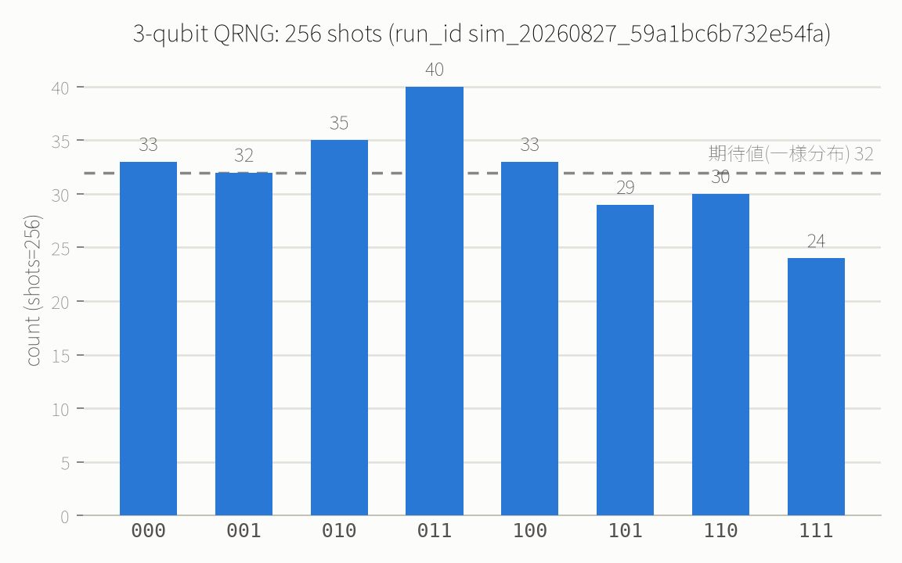

# 例6: 量子乱数生成（QRNG）— 監査可能な公正なサイコロ

`h` ゲートだけを並べて測定すると、量子力学的に予測不可能な乱数が得られます。これを応用して、
**6面サイコロを公正に振る**（棄却サンプリングで8通り→6通りに絞る）例です。

## 回路

3量子ビットすべてに `h` を掛けるだけで、`000`〜`111` の8通りが等確率で出る重ね合わせ状態になります。

```json
{
  "gates": [
    {"gate": "h", "qubits": [0]},
    {"gate": "h", "qubits": [1]},
    {"gate": "h", "qubits": [2]}
  ],
  "shots": 256,
  "output": "counts"
}
```

## 実行結果

```json
{
  "counts": {
    "000": 33, "001": 32, "010": 35, "011": 40,
    "100": 33, "101": 29, "110": 30, "111": 24
  },
  "shots": 256
}
```



期待値（256/8=32）を中心に、8通りの出目がほぼ均等にばらついています。

`proof`: [✓ 実行済み sim_20260827_59a1bc6b732e54fa](https://mcp.blueqat.app/runs/sim_20260827_59a1bc6b732e54fa)

## 応用: 8通り→6面サイコロへの棄却サンプリング

3量子ビットは2進数で`0`〜`7`の8通りしか作れず、そのままでは「6面サイコロ」になりません。
そこで、古典の乱数生成でも使われる**棄却サンプリング**を使います。

1. `000`〜`101`（10進数で0〜5）が出たら、それを `目+1` = 1〜6 の出目として採用する
2. `110`, `111`（6, 7）が出たら**棄却して振り直す**（もう一度回路を実行する）

上の実測データで実際にやってみると:

| ビット列 | 10進 | 採用/棄却 | 出目 |
|---|---|---|---|
| 000 | 0 | 採用 | 1 |
| 001 | 1 | 採用 | 2 |
| 010 | 2 | 採用 | 3 |
| 011 | 3 | 採用 | 4 |
| 100 | 4 | 採用 | 5 |
| 101 | 5 | 採用 | 6 |
| 110 | 6 | 棄却（振り直し） | - |
| 111 | 7 | 棄却（振り直し） | - |

採用された1〜6の6通りはどれも確率が等しいので（8通りが等確率で、そのうち等しい6通りだけを使うため）、
出来上がるのは偏りのない公正な6面サイコロです。棄却率は理論上 `2/8 = 25%` です。

## 実生活での意義

- **抽選・ガチャの公正性証明**: `run_id` を公開すれば、誰でも [verify_run](https://mcp.blueqat.app)
  で「本当にその乱数がその時刻に生成されたか」を検証できます。運営側が結果を後から操作していないことを
  第三者が確認できる仕組みになります。
- **暗号鍵生成**: 疑似乱数生成器(PRNG)と違い、量子測定の結果は原理的に予測不可能です。
- **モンテカルロシミュレーション**: 金融のリスク計算や物理シミュレーションで大量の乱数が必要な場面。

詳しい背景は [docs/applications.md](../docs/applications.md) を参照。
