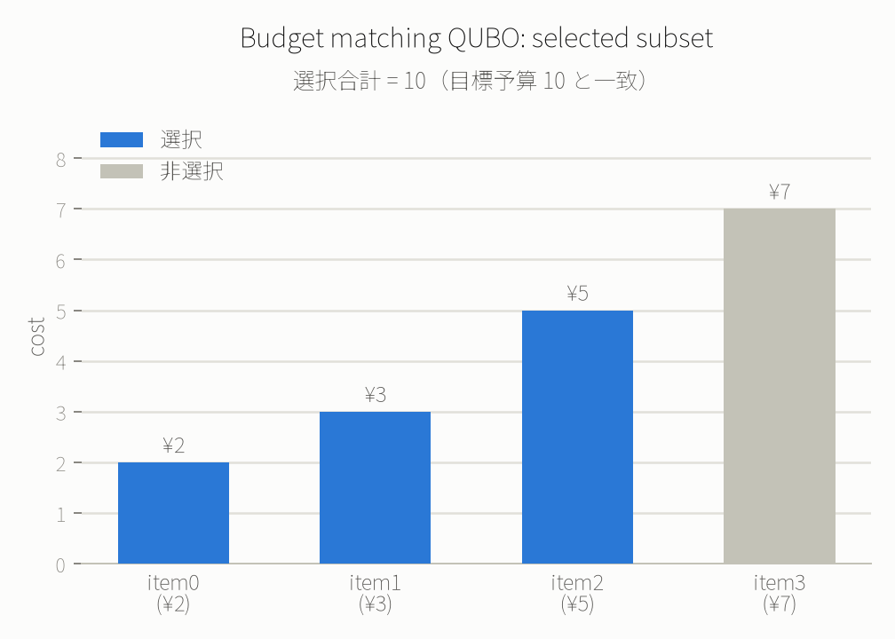

# 例7: QAOAで「予算ぴったり一致」問題を解く — 経理の消込・在庫の詰め合わせ

[例4](04_qaoa_maxcut.md)のMaxCutは「対立を避けるグループ分け」でしたが、今回は実務でよくある
**部分和問題（subset sum）**をQAOAで解きます。4つの案件の中から、合計金額がちょうど予算と一致する
組み合わせを選びます。この定式化は以下のような実務の場面にそのまま使えます。

- 経理: 複数の請求書・入金明細の中から、銀行の入金額とちょうど一致する組み合わせを探す「消込」作業
- 在庫: 決まった容量・重量にちょうど収まる荷物の組み合わせを選ぶ
- 予算執行: 決まった予算をちょうど使い切る発注の組み合わせを選ぶ

## 問題設定

4つの案件のコストが `[2, 3, 5, 7]`、目標予算が `10` のとき、合計がちょうど10になる部分集合を選びます
（$c_i$ はコスト、$x_i \in \{0,1\}$ は選ぶかどうか）。

$$
\min \quad \left( \sum_i c_i x_i - \text{budget} \right)^2
$$

を展開すると $x_i^2 = x_i$（0/1変数の性質）を使って、線形項と2次項だけのQUBOに落とし込めます。

$$
\text{coeff}(x_i) = c_i^2 - 2 \cdot \text{budget} \cdot c_i
\qquad
\text{coeff}(x_i, x_j) = 2 c_i c_j
$$

`c = [2, 3, 5, 7]`, `budget = 10` を代入すると:

```json
{
  "qubo": [
    {"coeff": -36, "qubits": [0]},
    {"coeff": -51, "qubits": [1]},
    {"coeff": -75, "qubits": [2]},
    {"coeff": -91, "qubits": [3]},
    {"coeff": 12, "qubits": [0, 1]},
    {"coeff": 20, "qubits": [0, 2]},
    {"coeff": 28, "qubits": [0, 3]},
    {"coeff": 30, "qubits": [1, 2]},
    {"coeff": 42, "qubits": [1, 3]},
    {"coeff": 70, "qubits": [2, 3]}
  ],
  "steps": 2,
  "shots": 256,
  "seed": 7,
  "n_starts": 1
}
```

`n_starts: 2` で最初に試したところ `Error executing tool run_qaoa: computation exceeded 10s and was
terminated` でfree tierのタイムアウト（10秒）に引っかかったため、`n_starts: 1` に落として再実行しました。
4量子ビット・10項のQUBOはfree tierの上限ぎりぎりの規模だと分かります。

## 結果

```json
{
  "mean_value": -87.1640625,
  "best": {"bitstring": "1110", "value": -100.0, "count": 25},
  "solutions": [
    {"bitstring": "1110", "value": -100.0, "count": 25},
    {"bitstring": "0101", "value": -100.0, "count": 1},
    {"bitstring": "1001", "value": -99.0, "count": 51},
    {"bitstring": "0110", "value": -96.0, "count": 74},
    "... (以下省略)"
  ]
}
```



`1110`（q0=1,q1=1,q2=1,q3=0 → item0,1,2を選択）の合計コストは `2+3+5=10` で目標予算にぴったり一致し、
理論上の最小値 $-\text{budget}^2 = -100$ を達成しています（この定式化では定数項 $\text{budget}^2$ を
省いているので、QUBO値`-100`は「誤差0でぴったり一致」を意味します）。

実はこの問題には**もう1つ**同じく誤差0の組み合わせがあります: `0101`（item1,3を選択、`3+7=10`）も
同じ`-100.0`を記録しており、QAOAのサンプリングでは頻度こそ低い(count=1)ものの正しく発見できています。
このように複数の最適解が存在する（縮退している）ことも、サンプリング結果からそのまま読み取れるのが
QAOAの利点です。

`proof`: [✓ 実行済み sim_20260827_849cbf3ba68a9c67](https://mcp.blueqat.app/runs/sim_20260827_849cbf3ba68a9c67)

## 実務に応用する時の注意

- 完全一致する組み合わせが存在しない場合は、QUBO値が最小でも0にはなりません。「最も予算に近い組み合わせ」
  として使えますが、必ず $\sum_i c_i x_i - \text{budget}$ を自分で計算して許容誤差内かを確認してください。
- 案件数が増えると2次項の数が $n(n-1)/2$ で急増します。free tierの制約（量子ビット10、タイムアウト10秒）
  を踏まえると、この定式化のままだと現実的なのはせいぜい10案件程度までです。
