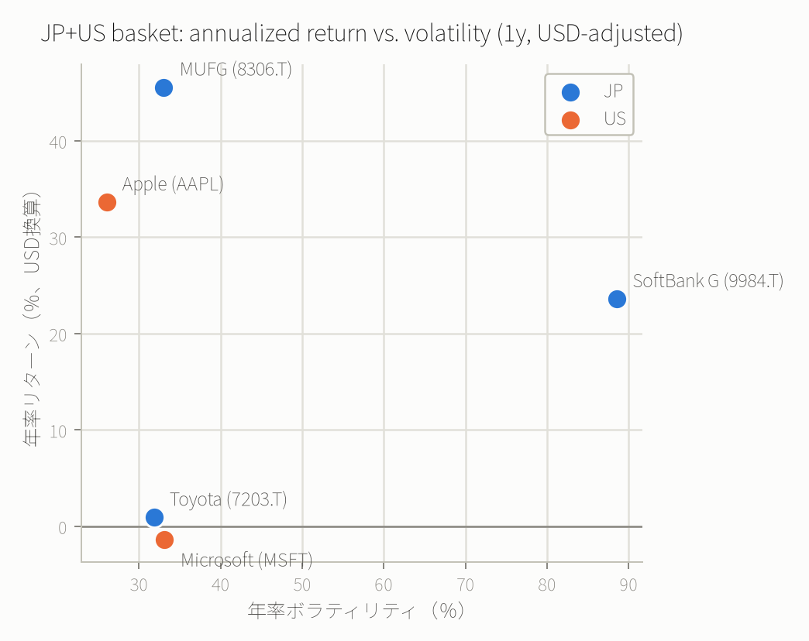

# 例8: QAOAで日米株ポートフォリオを選ぶ（Markowitz型・銘柄選択QUBO）

> **これは投資助言ではありません。** 過去1年間の実データを使った計算手法のデモです。
> 過去のリターン・リスクが将来も続く保証はなく、ここで選ばれた銘柄の組み合わせを推奨しているわけでも
> ありません。実際の投資判断は自己責任で行ってください。数値・最適解は
> データを取得した2026-08-27時点のスナップショットであり、再実行すると変わります。

日本株3銘柄・米国株2銘柄の実際の株価データを [yfinance](https://github.com/ranaroussi/yfinance) で取得し、
年率リターンと共分散（リスク）を計算した上で、「限られた銘柄数の中から最適な組み合わせを選ぶ」
Markowitz型のポートフォリオ選択問題をQUBOとして定式化し、`run_qaoa` で解きました。

## 対象銘柄とデータ取得

| ティッカー | 銘柄 | 市場 |
|---|---|---|
| 7203.T | トヨタ自動車 | JP |
| 8306.T | 三菱UFJフィナンシャル・グループ | JP |
| 9984.T | ソフトバンクグループ | JP |
| AAPL | Apple | US |
| MSFT | Microsoft | US |

- 期間: 直近1年（2025-08-27〜2026-08-26）の日次終値（配当・分割調整済み）
- 日本株はJPY建てなので、同期間のUSDJPYレート（`JPY=X`）で**USD建てに換算してから**対数リターンを計算
  （為替を無視して円建て・ドル建てのリターンをそのまま混ぜると、通貨変動分が誤って銘柄固有のリターン/
  リスクとして扱われてしまうため）
- 年率化: 日次対数リターンの平均・共分散をそれぞれ252倍

再現用スクリプト: [scripts/fetch_portfolio_data.py](../scripts/fetch_portfolio_data.py)
（`uv run --with yfinance --with pandas --with numpy python3 scripts/fetch_portfolio_data.py`）

### 取得結果（USD換算・年率）



| 銘柄 | 年率リターン | 年率ボラティリティ |
|---|---:|---:|
| Toyota (7203.T) | +0.94% | 31.9% |
| MUFG (8306.T) | +45.57% | 33.0% |
| SoftBank G (9984.T) | +23.61% | 88.6% |
| Apple (AAPL) | +33.65% | 26.0% |
| Microsoft (MSFT) | −1.35% | 33.1% |

ソフトバンクグループのボラティリティが突出して高い点に注目してください（このあとのQUBO最適化で
「リスクをどれだけ嫌うか」によって選ばれるかどうかが変わります）。

## QUBOの定式化

5銘柄から**ちょうど3銘柄**を均等ウェイト（各1/3）で選ぶ問題として定式化します。
`x_i ∈ {0,1}` を銘柄iを選ぶかどうかとして、

```
minimize:  −Σ r_i x_i  +  λ・[ Σ σ_ii x_i + 2 Σ_{i<j} σ_ij x_i x_j ]  +  P・(Σx_i − k)²
```

- 第1項: 選んだ銘柄の期待リターンの合計（大きいほど良いので符号を反転して最小化問題に）
- 第2項: 選んだ銘柄間の共分散の合計（＝分散、リスク）。`λ`が大きいほどリスクを嫌う
- 第3項: 「ちょうどk銘柄選ぶ」制約をペナルティとして組み込む（`P`は制約の強さ、`k=3`）

`x_i² = x_i`（0/1変数の性質）を使って展開すると、線形項・2次項だけのQUBOになります
（線形項15個、2次項…ではなく計15項: 線形5+2次10）。具体的な係数の導出は
[scripts/fetch_portfolio_data.py](../scripts/fetch_portfolio_data.py) の `build_qubo()` を参照してください。
ペナルティは `P=5` を使用しています。

**リスク許容度 `λ` を3パターン**で計算し、選ばれる組み合わせがどう変わるかを見ます。

## 結果: 3つのリスク許容度シナリオ

| シナリオ | λ | QAOAが選んだ銘柄 | 厳密解（総当たり）と一致 | 年率リターン | 年率ボラ | サンプル頻度 |
|---|---:|---|:---:|---:|---:|---:|
| リターン重視 | 0.1 | MUFG, SoftBank G, Apple | ✅ | 34.28% | 34.96% | 49/256 |
| バランス型 | 0.5 | MUFG, Apple, Microsoft | ✅ | 25.96% | 18.11% | 52/256 |
| リスク回避 | 3.0 | MUFG, Apple, Microsoft | ✅ | 25.96% | 18.11% | 6/256 |

- **リターン重視**（λ=0.1）ではボラティリティ88.6%のソフトバンクグループが選ばれ、年率34.28%という
  最高リターンの組み合わせになりました。
- **バランス型**（λ=0.5）と**リスク回避**（λ=3.0）はどちらも同じ組み合わせ（MUFG, Apple, Microsoft）を
  選びました。この3銘柄はリターン・リスクの両方でバランスが良く（年率ボラティリティが5組み合わせ中
  最小の18.11%）、リスク回避的な人にとってもリターン重視な人にとっても「そこそこ良い」組み合わせに
  なっているため、比較的広いλの範囲で最適であり続けます。

`proof`:
- リターン重視: [✓ 実行済み sim_20260827_f12b90ff800c199b](https://mcp.blueqat.app/runs/sim_20260827_f12b90ff800c199b)
- バランス型: [✓ 実行済み sim_20260827_9151273bc59161c8](https://mcp.blueqat.app/runs/sim_20260827_9151273bc59161c8)
- リスク回避: [✓ 実行済み sim_20260827_ca75ac071fef9b5f](https://mcp.blueqat.app/runs/sim_20260827_ca75ac071fef9b5f)

## 検証: QAOAは本当に正しい組み合わせを見つけたか

5銘柄から3銘柄を選ぶ組み合わせは `C(5,3)=10` 通りしかないので、総当たりで厳密解を計算して
QAOAの答えと突き合わせました（`exact_best()` 関数、[scripts/fetch_portfolio_data.py](../scripts/fetch_portfolio_data.py)）。

3シナリオとも、QAOAが最良値として報告した組み合わせは厳密解と完全に一致しました。ただし
**サンプル頻度**（256ショット中その組み合わせが実際に測定された回数）には大きな差があります。
リスク回避シナリオでは正解が256回中わずか6回しか出ておらず、QAOAの解自体は正しくても、
浅い回路（`steps=2`, free tierの上限）では最適解にサンプリング確率が強く集中しているわけではない、
という現実的な限界も見えます。実務でこの手法を使うなら、`best`（最良値のサンプル）だけでなく
上位複数のサンプルを候補として並べて人間が最終判断する、という使い方が現実的です。

## 投資の意思決定にどう活かせるか（と、活かせない部分）

**活かせる部分:**

- 「リスク許容度をどう数値化するか」を明示的にモデル化できる。`λ`を動かして選ばれる組み合わせの変化を
  見ることで、自分のポートフォリオが「リターン重視型」と「リスク回避型」のどちらの答えに近いかを
  チェックする材料になる。
- 銘柄数・制約が増えたときに人手では組み合わせ爆発してしまう問題（本例は`C(5,3)=10`通りだが、
  20銘柄から10銘柄選ぶだけで184,756通り）に対して、量子/古典ハイブリッドの近似解法という選択肢がある
  ことを体感できる。

**活かせない・注意すべき部分:**

- **均等ウェイトの銘柄選択（0/1）に単純化しています。** 実際のMarkowitz最適化は連続的な配分比率
  （例: MUFG 40%, Apple 35%, Microsoft 25%）まで最適化しますが、それには連続変数を量子ビットで
  離散近似する追加の工夫が必要で、本例のスコープ外です。
- **過去1年間のリターン・リスクは将来を保証しません。** 特にソフトバンクグループのような値動きの
  大きい銘柄は、参照期間を変えるだけで年率リターン・ボラティリティが大きく変わり得ます。
- **取引コスト・税金・配当再投資のタイミング・流動性制約は考慮していません。**
- **free tierのシミュレータ規模（10量子ビット・タイムアウト10秒）に収まる範囲でしか試せません。**
  実際の分散ポートフォリオ（数十銘柄）を丸ごと最適化するには、銘柄をあらかじめ業種・テーマで絞り込む
  などの前処理が必要です。

要するに、ここで示したのは「意思決定を助ける計算の型」であって「答え」そのものではありません。
自分の実際の投資判断に使うなら、`scripts/fetch_portfolio_data.py` の銘柄リストと `λ` を自分の
ウォッチリストとリスク許容度に置き換えて再実行し、出てきた候補を他の分析と合わせて検討する、
という使い方を想定しています。
