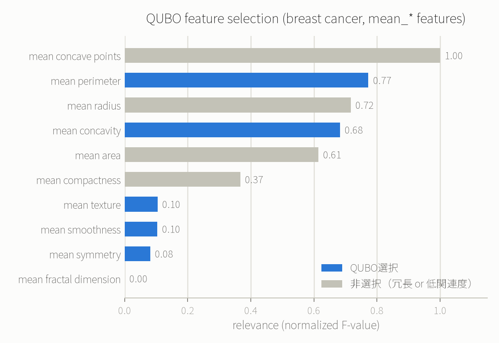

# 例9: QAOAでAI学習の特徴量選択（乳がん診断データ・mRMR型QUBO）

> **これは診断支援ではありません。** scikit-learn に標準搭載されている公開データセットを使った
> 計算手法のデモです。実際の医療診断や臨床判断に使うことを意図したものではありません。

AIモデルの学習を「速く・過学習しにくく」するための前処理として、候補となる特徴量の中から
「予測に効いて（relevance）、かつ互いに冗長でない（redundancy）」組み合わせを選ぶ、
mRMR型（minimum-Redundancy-Maximum-Relevance）の特徴量選択をQUBOとして定式化し、
`run_qaoa` で解きました。

## 題材とデータ

scikit-learn 標準搭載の[乳がん診断データセット](https://scikit-learn.org/stable/datasets/toy_dataset.html#breast-cancer-dataset)
（`load_breast_cancer`、外部フェッチ不要）から、"mean_*" 系の10特徴量をそのまま候補プールにします。
ちょうど10個あり、free tierの10量子ビット上限に過不足なく収まります。

| # | 特徴量 | # | 特徴量 |
|---:|---|---:|---|
| 0 | mean radius | 5 | mean compactness |
| 1 | mean texture | 6 | mean concavity |
| 2 | mean perimeter | 7 | mean concave points |
| 3 | mean area | 8 | mean symmetry |
| 4 | mean smoothness | 9 | mean fractal dimension |

再現用スクリプト: [scripts/build_feature_selection_qubo.py](../scripts/build_feature_selection_qubo.py)
（`uv run --with scikit-learn --with numpy --with pandas python3 scripts/build_feature_selection_qubo.py`）

## QUBOの定式化

$x_i \in \lbrace 0,1 \rbrace$ を特徴量 $i$ を選ぶかどうかとして、

$$
\min \quad -\alpha \sum_i r_i x_i + \beta \sum_{(i,j) \in E} c_{ij}\, x_i x_j
$$

- $r_i$: 目的変数（良性/悪性）との relevance（ANOVA F値を最大値で正規化、0〜1）
- $c_{ij}$: 特徴量 $i,j$ 間の redundancy（相関係数の絶対値）
- $E$: 冗長度ペナルティの対象ペア。**全45ペアではなく、多重共線性の一般的な目安である
  相関係数の絶対値 0.8 以上の9ペアだけ**

**free tierには `run_qaoa` に渡せるQUBOの項数が20までという制限があります（`sdk_info` の
表には出てこず、実際に55項（全45ペア+線形10）を投げて `CircuitBuildError: too many qubo terms
(max 20 on the free tier)` になって初めて分かりました）。** 「ちょうどk個選ぶ」ようなハードな
カーディナリティ制約を組み込むには本来全ペアの2次項が必要になり項数を大きく超えるため、今回は
そのアプローチを避け、冗長度ペナルティの対象を統計的にも標準的なしきい値（相関係数0.8以上）に
絞ることで、線形10項+2次9項=**19項**に収めました。選ぶ特徴量の個数はあらかじめ固定せず、
QUBOの最適化に委ねています。 $\alpha=\beta=1.0$ で、係数の導出は
[scripts/build_feature_selection_qubo.py](../scripts/build_feature_selection_qubo.py) の
`build_qubo()` を参照してください。

## 結果

QAOA（`steps=2`, `shots=256`, `seed=42`）が最良として報告した組み合わせ:

| 選択 | 特徴量 | relevance |
|---|---|---:|
| ✅ | mean perimeter | 0.77 |
| ✅ | mean concavity | 0.68 |
| ✅ | mean texture | 0.10 |
| ✅ | mean smoothness | 0.10 |
| ✅ | mean symmetry | 0.08 |
| ✅ | mean fractal dimension | 0.00 |
| ❌ | **mean concave points**（relevance最大 1.00） | — |
| ❌ | mean radius | — |
| ❌ | mean area | — |
| ❌ | mean compactness | — |

最も relevance が高い `mean concave points`（1.00）が**選ばれていません**。理由は redundancy
にあります。このデータセットでは「腫瘍のサイズ・形状」を表す特徴量（radius, perimeter, area,
compactness, concavity, concave points）が互いに強く相関しており（最大で相関係数0.998）、
`mean concave points` は9つの冗長度ペナルティ対象ペアのうち5つに関わる「最も冗長な」特徴量でも
あります。QUBOはこれを避け、冗長度ペナルティを受けない `mean concavity`（同じ「凹み」の情報を
別の切り口で持つがペナルティ対象ペアが少ない）を代わりに選びました。

`proof`:
[✓ 実行済み sim_20260828_aa9c17f75172fdf8](https://mcp.blueqat.app/runs/sim_20260828_aa9c17f75172fdf8)

## 検証: QAOAは本当に正しい組み合わせを見つけたか

$2^{10}=1024$ 通りは古典で一瞬で総当たりできるので、QAOAに渡したのと**全く同じQUBO多項式**を
厳密に最小化して突き合わせました（`exact_best()` 関数、実際に探索する空間はQAOAと同じ全1024状態）。

QAOAが報告した最良解 `0110101011`（目的関数値 -1.744573）は、厳密解と**完全に一致**しました。
ただしサンプル頻度は256ショット中わずか4回（約1.6%）です。`mean fractal dimension` の relevance
がほぼゼロ（0.0000）のため、そのビットだけが異なるほぼ同値の解 `0110101010`（5回、値 -1.744533）
と合わせても、真の最適解相当の解は256回中9回（約3.5%）しかサンプリングされていません。
[例8](08_qaoa_portfolio_jp_us.md)でも見られた通り、free tierの浅い回路（`steps=2`が上限）では
「答え自体は正しいが、サンプリング確率がそこに強く集中しているわけではない」という現実的な限界が
ここでも見えます。

## 実際にAI学習の役に立つのか（と、役に立たない部分）

**古典的な特徴量選択・全特徴量利用とのロジスティック回帰テスト精度比較**（テストセット約171件、
1%未満の差は誤差の範囲として読んでください）:

| 方法 | 選択数 | 選ばれた特徴量 | テスト精度 |
|---|---:|---|---:|
| **QUBO最適解（このQUBOの厳密解＝QAOAの解と一致）** | 6 | texture, perimeter, smoothness, concavity, symmetry, fractal dimension | **0.9298** |
| 全10特徴量をそのまま使用 | 10 | （全部） | 0.9181 |
| SelectKBest（古典・ANOVA F値、同数k=6で比較） | 6 | radius, perimeter, area, compactness, concavity, concave points | 0.9006 |

**活かせる部分:**

- 今回はredundancy考慮ありのQUBO選択が、同じ6個を選ぶ古典的なSelectKBest（redundancy非考慮）より
  高いテスト精度になりました。ただしテストセットが171件しかないため、この差（約3ポイント）は
  1回の分割での結果であり、統計的に有意と言い切れるほどの差ではありません。**「量子が古典的な
  特徴量選択に勝った」と一般化するのではなく、「関連度だけでなく冗長度も考慮する定式化には、
  この規模でも意味のある違いが出ることがある」という程度に読むのが誠実です**
  （[docs/when_to_use_quantum.md](../docs/when_to_use_quantum.md)参照）。
- QUBOの解自体は上の「検証」の通り厳密解と一致しており、**QAOAがこの小規模QUBOを正しく解けている
  ことは確認できています**。ここで比較しているのは「QAOAが正しく解けたか」ではなく「そもそもこの
  mRMR型の定式化が、単純な関連度ベースの選択より優れているか」という、QUBOの中身についての問いです。
- 特徴量数が増えるほど組み合わせが爆発する問題（10特徴量から6個選ぶだけで210通り、実際のデータ
  セットでは数百〜数千特徴量が珍しくない）に対して、古典の完全探索が非現実的になった先の選択肢として
  QAOAのような近似解法がある、という型を体感できる。

**活かせない・注意すべき部分:**

- **relevance（ANOVA F値）・redundancy（相関係数）はどちらも古典計算です。** QAOAが担っているのは
  「与えられたQUBOを近似的に解く」部分だけで、特徴量の統計量そのものを量子コンピュータで計算して
  いるわけではありません。
- **free tierのQUBO項数上限（20）が、定式化そのものを制約しています。** 本来のmRMRは全ペアの
  冗長度を考慮しますが、ここでは相関0.8以上の9ペアだけに絞らざるを得ませんでした。候補特徴量が
  増えるほどこの制約は厳しくなります。
- **この規模（候補10特徴量）は古典の全探索で瞬時に厳密解が求まります。** 実際に特徴量選択の恩恵が
  量子/古典近似解法で意味を持つのは、候補が数百〜数千個になり全探索もSelectKBest系の貪欲法も
  非現実的になる場面ですが、そこまでの規模はfree tierのQUBO項数上限のためにこのMCPでは試せません。
- **1回のtrain/testスプリットでの精度比較です。** 交差検証やより大きなテストセットでの再検証は
  していません。

自分のデータで試すなら、`scripts/build_feature_selection_qubo.py` の `MEAN_FEATURES` と
`CORR_THRESHOLD` を自分の候補特徴量とドメインの多重共線性の目安に置き換えて再実行し、必ず
SelectKBestなど古典手法との比較を並べて確認する、という使い方を想定しています。
