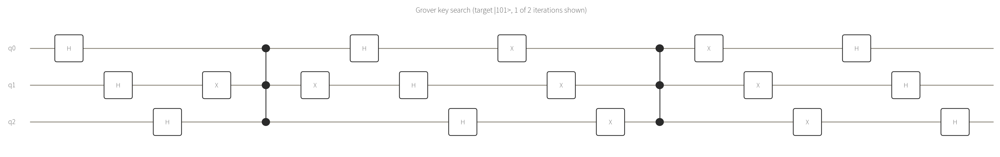

# 例10: Grover探索で「トイ暗号」の鍵を復元する（暗号解読・鍵長設計への含意）

> **これは実在の暗号システムへの攻撃ツールではありません。** ここで探索するのは3bit（候補8通り）の
> 架空のトイ暗号であり、AESなど実在の暗号を攻撃する回路ではありません。実在の対称鍵暗号を量子コン
> ピュータのGrover探索で攻撃するには、暗号の暗号化処理そのものを可逆回路として実装する必要があり、
> 例えばAES-128に対しては論理量子ビット数にして約2,953個・莫大な回路深度が必要になると試算されて
> います（Grassl, Langenberg, Roetteler, Steinwandt, "Applying Grover's Algorithm to AES: Quantum
> Resource Estimates", 2016）。現在のNISQデバイス（このMCPのfree tierはもちろん、最先端の実機を
> 含めても）でこれを実行することは現実的に不可能です。**このリポジトリの結果を根拠に「量子コンピュ
> ータは今すぐAESを破れる」と主張するのは誤りです。**
>
> **この例の意図は攻撃手法の提供ではありません。** Groverアルゴリズムが対称鍵の実効的な安全性に
> どう影響するかを理解し、自分自身のセキュリティ対策（鍵長の選び方、PQC移行の検討など）や、
> 社会全体の暗号運用を見直す議論に役立ててもらうことを意図しています。悪用を意図した情報は
> 含んでいませんし、悪用のために使われることも望んでいません。

[例3](03_grover_search.md)のGrover探索を3量子ビット（探索空間 $N=8$）に拡張し、「既知の平文・暗号
文のペアから、架空のトイ暗号の秘密鍵（3bit、候補8通り）を復元する」という鍵探索の形で実行します。
実際の暗号解読でも、対称鍵暗号を総当たりで攻撃する（＝正しい鍵を見つけるまで候補を試す）という
基本構造は同じです。

## 定式化

秘密鍵 $K=101_2$（10進で5）を、オラクルが直接マークする形にしています（オラクルの中で実際に暗号化
処理を計算しているわけではなく、「候補鍵 $K'$ で暗号化した結果が既知の暗号文と一致するか」という
判定を、結果的に唯一の正解鍵 $K$ だけをマークする位相反転として表現しています。実在の暗号に対する
本物の攻撃で難しいのは、この暗号化処理そのものを可逆回路として実装する部分です）。

使える制御ゲートは `ccz` / `ccx`（2制御まで）なので、3量子ビットの探索空間に収め、3制御以上が
必要になる4bit以上の鍵候補空間（[例9](09_qaoa_feature_selection.md)で発見したQUBO項数の制約と同様、
free tierの実際の制約に合わせた設計判断です）は避けています。

$N=8$（最適反復回数 $\lfloor \frac{\pi}{4}\sqrt{8} \rfloor = 2$ 回）で実行:

```json
{
  "gates": [
    {"gate": "h", "qubits": [0]}, {"gate": "h", "qubits": [1]}, {"gate": "h", "qubits": [2]},
    {"gate": "x", "qubits": [1]}, {"gate": "ccz", "qubits": [0, 1, 2]}, {"gate": "x", "qubits": [1]},
    {"gate": "h", "qubits": [0]}, {"gate": "h", "qubits": [1]}, {"gate": "h", "qubits": [2]},
    {"gate": "x", "qubits": [0]}, {"gate": "x", "qubits": [1]}, {"gate": "x", "qubits": [2]},
    {"gate": "ccz", "qubits": [0, 1, 2]},
    {"gate": "x", "qubits": [0]}, {"gate": "x", "qubits": [1]}, {"gate": "x", "qubits": [2]},
    {"gate": "h", "qubits": [0]}, {"gate": "h", "qubits": [1]}, {"gate": "h", "qubits": [2]}
  ]
}
```
（↑1反復分。2反復目として上のオラクル+拡散のブロックをもう一度繰り返します。合計35ゲート・深さ17。）

## 回路図（1反復目のみ）



```
Grover key search (target |101>, 1 of 2 iterations shown)
q0: H---CCZ-H-X---CCZ-X-H
         |         |
q1: H-X-CCZ-X-H-X-CCZ-X-H
         |         |
q2: H---CCZ-H-X---CCZ-X-H
```

## 実行結果（counts, 256ショット）

```json
{
  "counts": {
    "101": 244, "111": 3, "100": 2, "010": 2, "001": 2, "110": 1, "000": 1, "011": 1
  },
  "shots": 256,
  "bit_order": "bitstring[0] is qubit 0"
}
```

256ショット中244回（95.3%）が正解の鍵 `101` になりました。 $N=8$ に対する2反復は理論上の最適値と
厳密には一致しない端数が残るため100%にはなりませんが（ $N=8$ は例3の $N=4$ と違って反復回数が
ちょうど整数で100%になる特殊ケースではありません）、圧倒的多数が正解に集中しています。

`proof`: [✓ 実行済み sim_20260828_4c579977768c61b1](https://mcp.blueqat.app/runs/sim_20260828_4c579977768c61b1)

## 暗号解読としての含意（と、誇張しない部分）

**理論的に言えること:**

- 古典的な総当たり攻撃は候補鍵 $N$ 個に対して平均 $N/2$ 回の試行が必要ですが、Grover探索は理論上
  $O(\sqrt{N})$ 回で済みます。この例では $N=8$ に対し、古典の平均4回に対しGroverは2反復です。
- この「探索空間の平方根」という性質から、対称鍵暗号（AES等）の鍵長を量子コンピュータへの耐性の
  観点で設計する際は、**鍵長を2倍にすることで古典的な安全性水準を維持できる**という考え方が広く
  採用されています（AES-128の量子攻撃への実効的な安全性はAES-64相当に低下するため、長期的な
  安全性が必要な用途ではAES-256が推奨される、という文脈です）。

**このリポジトリの実験からは言えないこと:**

- **実在の暗号を攻撃したわけではありません。** 上の免責事項の通り、実在の対称鍵暗号への攻撃には
  暗号化処理を可逆回路として実装する必要があり、現在のハードウェア規模を大きく超えます。
- **鍵長が増えるとこのリポジトリでは追試できません。** free tierの10量子ビット上限・
  QUBO/回路ゲート数の制約により、この定式化のまま4bit以上の鍵探索を試すには3制御ゲートの
  アンシラ分解などの追加実装が必要です。
- **「量子コンピュータが実用化されればすぐ危険になる」わけではありません。** 現実的な脅威になる
  時期は、誤り訂正機能を備えたフォールトトレラント量子コンピュータの実現規模に強く依存し、
  現時点では研究段階です（[docs/when_to_use_quantum.md](../docs/when_to_use_quantum.md)参照）。
  だからこそNIST等は「今すぐ危険」ではなく「将来に備えて今から鍵長・アルゴリズムを見直す」という
  予防的な姿勢を取っています。

自分の理解のために試すなら、`qubits`のターゲットビット列（オラクルの`x`を挟む位置）を変えて別の
3bit鍵を探索してみる、または`steps`に相当する反復回数を1回に減らして成功確率がどう下がるかを
確認する、という使い方を想定しています。
