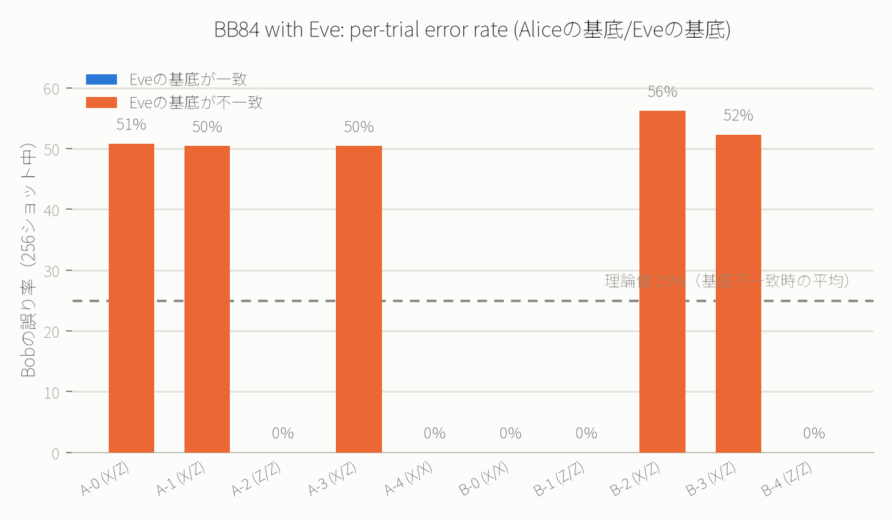

# 例11: BB84量子鍵配送 — 盗聴の統計的検知をシミュレーションする

> **これは実際の秘密鍵配送には使用できません。** この実行はblueqatのクラウドシミュレータ上で
> 行われており、Alice・Bobを隔てる実際の量子通信路（光ファイバーや自由空間光学系）を経由して
> いません。ここで示しているのは「盗聴によって統計的に検知可能な誤りが生じる」というBB84の
> 数理的性質そのものであり、**この実行結果自体を実際の暗号鍵として使うことはできません。**
> 実運用のQKDには専用のハードウェア（量子鍵配送装置）と認証済みの古典通信路が必要です。

QAOA/VQEの「速く解く」話とは違い、BB84量子鍵配送の価値は**速度ではなく、盗聴が物理法則によって
統計的に検知できるという性質**にあります（[例6の量子乱数生成](06_quantum_random_number_generator.md)
と同じ「質的な優位性」の系統です）。この例では、盗聴者Eveがいる場合といない場合で、Bobの受信誤り率が
理論通りに変化することを、実際に`run_circuit`で確認します。

## 途中測定なしでEveの盗聴をどう表現するか

blueqat MCPの`run_circuit`には「測定してから条件分岐する」という途中測定のAPIがありません。
そこで、量子力学の標準的な等価性（**量子ビットをアンシラに絡めて、そのアンシラを二度と読み出さない
ことは、実際に測定して結果を捨てるのと統計的に等価**）を使い、Eveの「横取り→測定→再送」を
純粋なユニタリ回路として表現します。

各トライアルは信号量子ビット1個+アンシラ量子ビット1個のペアです（5トライアル/回路 = 10量子ビットで
free tierの上限にちょうど収まります）。

1. **Aliceの準備**: ビット $a$ と基底 $\alpha \in \lbrace Z, X \rbrace$ をランダムに選び、信号量子ビットを
   準備（ $\alpha=Z$ なら $X$ ゲートのみ、 $\alpha=X$ なら $X$ ゲートの後に $H$ ）
2. **Eveの盗聴**（ありの場合のみ）: 独立にランダムな基底 $\varepsilon$ を選び、信号をEveの基底に
   回転 → `cx`（信号→アンシラ）で絡める → 信号をEveの基底から戻す
3. **Bobの復号**: Aliceと同じ基底（今回は基底が一致したトライアルだけを対象にしています。
   一致しないトライアルは実際のBB84でも公開比較の後に破棄されるだけなので、シミュレーション対象外
   で問題ありません）に信号を回転して測定

再現用スクリプト: [scripts/build_bb84_circuit.py](../scripts/build_bb84_circuit.py)
（`uv run python3 scripts/build_bb84_circuit.py`。`random.Random(0)`で決定論的に再現できます）

## 実行結果

### ベースライン: Eveなし（5トライアル、256ショット）

```json
{"gates": [
  {"gate": "x", "qubits": [0]}, {"gate": "h", "qubits": [0]}, {"gate": "h", "qubits": [0]},
  {"gate": "h", "qubits": [2]}, {"gate": "h", "qubits": [2]},
  {"gate": "x", "qubits": [4]}, {"gate": "h", "qubits": [4]}, {"gate": "h", "qubits": [4]},
  {"gate": "x", "qubits": [6]}, {"gate": "h", "qubits": [6]}, {"gate": "h", "qubits": [6]},
  {"gate": "x", "qubits": [8]}
]}
```

結果: `"1000101010"` が256/256ショット全て（**誤り率0%**）。基底が一致していれば量子力学的に
決定論的な結果になるため、当然の結果です。

`proof`: [✓ 実行済み sim_20260828_5b0514725365a1cd](https://mcp.blueqat.app/runs/sim_20260828_5b0514725365a1cd)

### Eveあり（2ラウンド×5トライアル = 10トライアル、各256ショット）



| トライアル | Aliceの基底 | Eveの基底 | 一致? | 誤り率(/256) |
|---|:---:|:---:|:---:|---:|
| A-0 | X | Z | ❌ | 50.8% |
| A-1 | X | Z | ❌ | 50.4% |
| A-2 | Z | Z | ✅ | 0.0% |
| A-3 | X | Z | ❌ | 50.4% |
| A-4 | X | X | ✅ | 0.0% |
| B-0 | X | X | ✅ | 0.0% |
| B-1 | Z | Z | ✅ | 0.0% |
| B-2 | X | Z | ❌ | 56.2% |
| B-3 | X | Z | ❌ | 52.3% |
| B-4 | Z | Z | ✅ | 0.0% |

`proof`:
- ラウンドA: [✓ 実行済み sim_20260828_9a65f51c025bda9e](https://mcp.blueqat.app/runs/sim_20260828_9a65f51c025bda9e)
- ラウンドB: [✓ 実行済み sim_20260828_244ae24dcbebd881](https://mcp.blueqat.app/runs/sim_20260828_244ae24dcbebd881)

Eveの基底がAliceと**一致した5トライアル**は誤り率0.0%ぴったり。**不一致だった5トライアル**は
いずれも50%前後（50.4%〜56.2%）に集中しています。理論上、Eveの基底が独立にランダムなら
一致確率50%・不一致時の誤り率50%なので、平均誤り率は $0.5 \times 0 + 0.5 \times 0.5 = 0.25$ 、つまり25%に
なるはずです。10トライアル・2560ショット全体での実測誤り率は **666/2560 = 26.0%** で、理論値25%と
よく一致しました。

## これがBB84のセキュリティの核心

Alice・Bobは実際には「どのトライアルでEveが盗聴したか」を個別には知りません。彼らが実際に行うのは、
シフト済み鍵の一部を無作為に選んで公開比較し、**誤り率が理論的に期待される水準（盗聴がなければ
ほぼ0%）より明らかに高いかどうか**をチェックすることです。上の実験が示す通り、Eveが割り込むと
誤り率が統計的に検知可能な水準（約25%）まで跳ね上がるため、鍵の残り部分を安全に使う前に盗聴の
存在をアルゴリズム的に検知できます（実際のプロトコルでは、検知したらその鍵材料は破棄して
やり直します）。

## 誇張しない部分

- **繰り返しますが、この実行結果は実際の秘密鍵として使えません。** 実際のQKDの安全性は「量子状態は
  複製できない（no-cloning定理）」「測定すると状態が乱される」という物理法則が、物理的に隔離された
  量子通信路上で成り立つことに依存しています。ここではAlice・Bob・Eveの回路をすべて同じMCP
  サーバー上の1つのシミュレーション内で計算しているだけで、物理的に分離された通信路は存在しません。
- **アンシラによる「絡めて読み出さない」手法は数学的に測定と等価ですが、実際のEveの盗聴装置が
  内部で何をしているかを模したものではありません。** ここでの目的は「盗聴があると統計的な誤りが
  生じる」という結果を再現することです。
- **基底が一致しないトライアル（シフティングで捨てられる分）はシミュレーションしていません。**
  実際のBB84では生の鍵材料の約半分がこの段階で捨てられます。
- **実際のセキュリティ証明（情報理論的安全性）は、この誤り率検知だけでなく、誤り訂正・秘匿性
  増強（privacy amplification）などの後処理を含めた、より精緻な議論に基づきます。** ここではその
  核となる「盗聴は検知可能」という部分だけを取り出しています。
