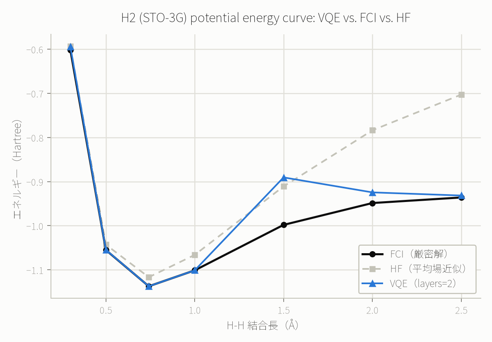

# 例12: VQEで水素分子（H2）の基底エネルギーを求める — 量子化学の入り口

[例5](05_vqe_transverse_ising.md)のVQEはイジング模型という物理の教科書的な模型でしたが、ここでは
実在の分子（水素分子、H2）の電子構造計算に同じ仕組みを使います。PySCFとOpenFermionで実際の
量子化学計算を行い、Jordan-Wigner変換で得た4量子ビットのハミルトニアンを `run_vqe` に渡し、
古典的な厳密解（FCI）・平均場近似（HF）と正面から比較します。

## 分子からハミルトニアンへ

H2分子をSTO-3G基底（最小基底、量子化学の教科書で最初に使われる基底系）で扱うと、Jordan-Wigner
変換後にちょうど**4量子ビット・14項**のハミルトニアンになり、free tierの上限（10量子ビット、
ハミルトニアン最大20項）に余裕を持って収まります。

再現用スクリプト: [scripts/build_h2_vqe.py](../scripts/build_h2_vqe.py)
（`uv run --with pyscf --with openfermion --with openfermionpyscf python3 scripts/build_h2_vqe.py`）

結合長 0.7414 Å（実験的な平衡結合長）でのハミルトニアン（14項）:

```json
[
  {"coeff": 0.17119775, "paulis": [{"op": "Z", "qubit": 0}]},
  {"coeff": 0.17119775, "paulis": [{"op": "Z", "qubit": 1}]},
  {"coeff": -0.22278593, "paulis": [{"op": "Z", "qubit": 2}]},
  {"coeff": -0.22278593, "paulis": [{"op": "Z", "qubit": 3}]},
  {"coeff": 0.16862219, "paulis": [{"op": "Z", "qubit": 0}, {"op": "Z", "qubit": 1}]},
  {"coeff": 0.0453222, "paulis": [{"op": "Y", "qubit": 0}, {"op": "X", "qubit": 1}, {"op": "X", "qubit": 2}, {"op": "Y", "qubit": 3}]},
  {"coeff": -0.0453222, "paulis": [{"op": "Y", "qubit": 0}, {"op": "Y", "qubit": 1}, {"op": "X", "qubit": 2}, {"op": "X", "qubit": 3}]},
  {"coeff": -0.0453222, "paulis": [{"op": "X", "qubit": 0}, {"op": "X", "qubit": 1}, {"op": "Y", "qubit": 2}, {"op": "Y", "qubit": 3}]},
  {"coeff": 0.0453222, "paulis": [{"op": "X", "qubit": 0}, {"op": "Y", "qubit": 1}, {"op": "Y", "qubit": 2}, {"op": "X", "qubit": 3}]},
  {"coeff": 0.12054482, "paulis": [{"op": "Z", "qubit": 0}, {"op": "Z", "qubit": 2}]},
  {"coeff": 0.16586702, "paulis": [{"op": "Z", "qubit": 0}, {"op": "Z", "qubit": 3}]},
  {"coeff": 0.16586702, "paulis": [{"op": "Z", "qubit": 1}, {"op": "Z", "qubit": 2}]},
  {"coeff": 0.12054482, "paulis": [{"op": "Z", "qubit": 1}, {"op": "Z", "qubit": 3}]},
  {"coeff": 0.17434844, "paulis": [{"op": "Z", "qubit": 2}, {"op": "Z", "qubit": 3}]}
]
```

核間反発を含む定数項（-0.098864 Hartree）はこのハミルトニアンに含まれていません。`run_vqe` が
返す電子エネルギーにこの定数を後から足すことで、分子の全エネルギーになります（量子化学計算では
標準的な扱いです）。

## 結果: ポテンシャルエネルギー曲線（7点、layers=2）



| 結合長(Å) | HF | FCI（厳密解） | VQE（全エネルギー） | VQE−FCI |
|---:|---:|---:|---:|---:|
| 0.30 | -0.593828 | -0.601804 | -0.594490 | +0.007314 |
| 0.50 | -1.042996 | -1.055160 | -1.054792 | +0.000368 |
| **0.7414（平衡）** | -1.116684 | -1.137270 | **-1.137270** | **+0.000000** |
| 1.00 | -1.066109 | -1.101150 | -1.101146 | +0.000004 |
| 1.50 | -0.910874 | -0.998149 | -0.890585 | **+0.107564** |
| 2.00 | -0.783793 | -0.948641 | -0.924536 | +0.024105 |
| 2.50 | -0.702944 | -0.936055 | -0.931634 | +0.004421 |

（エネルギー単位はHartree。「化学的精度」の目安は誤差0.0016 Hartree程度とされます。）

`proof`（結合長順）:
- 0.3Å: [✓ sim_20260828_d3757eee96d5a82a](https://mcp.blueqat.app/runs/sim_20260828_d3757eee96d5a82a)
- 0.5Å: [✓ sim_20260828_9512e46d26832e2d](https://mcp.blueqat.app/runs/sim_20260828_9512e46d26832e2d)
- 0.7414Å: [✓ sim_20260828_9006e43fdd3d5b3c](https://mcp.blueqat.app/runs/sim_20260828_9006e43fdd3d5b3c)
- 1.0Å: [✓ sim_20260828_e8e9a237b066451f](https://mcp.blueqat.app/runs/sim_20260828_e8e9a237b066451f)
- 1.5Å: [✓ sim_20260828_9f56ec5b978b6306](https://mcp.blueqat.app/runs/sim_20260828_9f56ec5b978b6306)
- 2.0Å: [✓ sim_20260828_b115b324122b8476](https://mcp.blueqat.app/runs/sim_20260828_b115b324122b8476)
- 2.5Å: [✓ sim_20260828_cf910ed98426ccea](https://mcp.blueqat.app/runs/sim_20260828_cf910ed98426ccea)

## 平衡結合長ではFCIと完全一致、しかし1.5Åでは大きく外れた

**平衡結合長（0.7414Å）と1.0Åでは、VQEはFCI（厳密解）と小数点以下6桁まで一致しました。** H2の
STO-3G基底は電子2個・4量子ビットという最小規模のため、`layers=2`のhardware-efficientアンザッツ
（RY回転+CZ鎖）でも表現力が十分だったと考えられます。

**一方、結合長1.5Åでは誤差が+0.107564 Hartreeと突出して大きくなりました。** これは化学的精度
（0.0016 Hartree）を50倍以上超えています。原因を`top_states`で確認すると、他の結合長では
主に `1100`/`0011` の重ね合わせに収束しているのに対し、1.5Åでは `0101`（35.1%）・`0110`（24.1%）・
`1001`（24.1%）・`1010`（16.6%）という全く異なる4状態に分散した解に収束していました
（[optimized_paramsの実際の値](https://mcp.blueqat.app/runs/sim_20260828_9f56ec5b978b6306)も
他の結合長と質的に異なるパターンです）。これはVQEの古典最適化が**局所解に捕まった**典型例と
考えられます（VQEでは初期パラメータや損失地形（バレンプラトー等）によって最適化が本当の基底状態に
到達しない、という既知の課題です）。

**この結果を「もっと良い数値が出るまで」再実行して差し替えることはしていません。** うまくいかない
結果もそのまま報告するのが、このリポジトリの方針です（[docs/when_to_use_quantum.md](../docs/when_to_use_quantum.md)参照）。

## HFとの比較で見えるVQEの意味

結合長が伸びる（分子が解離に近づく）につれてHF（平均場近似）はFCIから大きく乖離していきます
（2.5Åで誤差+0.233 Hartree）。これは「HFの解離問題」として知られる、平均場近似が強相関領域で
定性的に破綻する現象です。VQEは1.5Åで局所解に捕まったものの、2.0Å・2.5Åでは**HFよりFCIに近い**
結果を返しており、電子相関を部分的に捉えられていることが見て取れます。

## 量子化学としての含意（と、誇張しない部分）

**理論的に言えること:**

- 分子・材料の性質は電子状態のハミルトニアンの基底エネルギーで決まりますが、古典コンピュータでの
  厳密計算（FCI）は電子数に対して指数関数的に困難になります。VQEはこれを量子コンピュータで近似的に
  求める代表的な手法です。
- H2/STO-3Gのような最小系では、この例の通りVQEがFCIとほぼ完全に一致する結果を出せます。

**このリポジトリの実験からは言えないこと:**

- **STO-3G自体が粗い近似です。** 実務の創薬・材料計算では、STO-3Gよりずっと大きな基底関数系
  （cc-pVDZ等）や、より高精度な電子相関の扱いが必要で、必要な量子ビット数も桁違いに増えます。
- **VQEの最適化は保証された収束を持ちません。** 上の1.5Åの結果が示す通り、同じ手法・同じ回路構造
  でも局所解に捕まることがあります。
- **free tierの`layers=2`は表現力の上限です。** より複雑な分子・より強い電子相関が必要な系では、
  より深いアンザッツやより洗練された最適化手法が必要になり、free tierの制約を超えます。
- **原子核の運動（振動・回転）は扱っていません。** ここで計算しているのは固定した核配置での電子
  エネルギー（Born-Oppenheimer近似）のみです。

自分の分子で試すなら、`scripts/build_h2_vqe.py`の`geometry`を別の小分子（LiHなど、ただし量子ビット
数がすぐ増える点に注意）に置き換えて再実行する、という使い方を想定しています。
