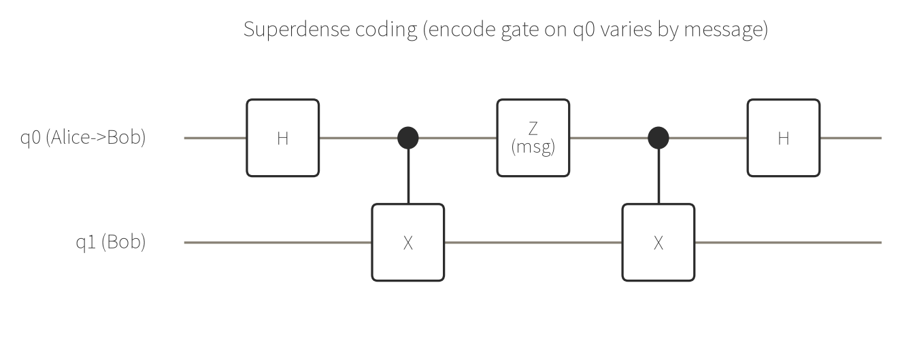

# 例13: スーパーデンスコーディング（1量子ビットで2古典ビット送る）

ベル状態（例1）を使った通信プロトコルです。Alice と Bob が事前にベル対を1組共有しておけば、
Alice は**自分側の1量子ビットだけ**に1つのゲートをかけて Bob に送るだけで、2bit分のメッセージ
（`00`/`01`/`10`/`11`）を伝えられます。量子テレポーテーションの「逆」にあたる有名なプロトコルです
（テレポーテーションは2古典ビット＋エンタングルメントで1量子ビットを送る）。

## 仕組み

1. **事前配布**: q0（Alice側）と q1（Bob側）でベル対を作る（`h q0` → `cx q0,q1`）
2. **Aliceの符号化**: 送りたい2bitに応じて、Alice が **q0 だけ** にゲートをかける

   | メッセージ | Aliceがq0にかけるゲート |
   |---|---|
   | `00` | 何もしない（I） |
   | `01` | `x` |
   | `10` | `z` |
   | `11` | `x` の後に `z` |

3. **転送**: Alice は q0 を Bob に渡す（このリポジトリのシミュレータ上では同じレジスタなので「転送」は概念上のものですが、実機では本当にこの1量子ビットだけを物理的に送る）
4. **Bobの復号**: Bob が両方の量子ビットを使って `cx q0,q1` → `h q0` → 測定



テキスト表現（`draw_circuit` が実際に返した内容。ここでは message=`10` の `z` ゲートを例に表示）:

```
Superdense coding (message=10)
q0: H-*-Z-*-H
      |   |
q1: --X---X--

凡例: * = 制御, X = 標的(CNOT), x = SWAP, + = 縦線が横切るだけ（無関係）
```

4通りとも決定論的な回路（測定以外に乱数要素なし）なので、256ショットとも100%同じビット列になるはずです。
実際に4パターンすべてを `run_circuit` で実行して確認しました。

## メッセージ `00`（Aliceは何もしない）

### リクエスト

```json
{
  "gates": [
    {"gate": "h", "qubits": [0]},
    {"gate": "cx", "qubits": [0, 1]},
    {"gate": "cx", "qubits": [0, 1]},
    {"gate": "h", "qubits": [0]}
  ],
  "shots": 256,
  "output": "counts"
}
```

### 結果

```json
{
  "counts": { "00": 256 },
  "shots": 256,
  "bit_order": "bitstring[0] is qubit 0"
}
```

Bobの測定は256回とも `00`。Aliceが何も符号化しなければ、Bobはそのまま `00` を復号します。

`proof`: [✓ 実行済み sim_20260829_67bc17cb6fcf2c67](https://mcp.blueqat.app/runs/sim_20260829_67bc17cb6fcf2c67)

## メッセージ `01`（Aliceが `x` をかける）

### リクエスト

```json
{
  "gates": [
    {"gate": "h", "qubits": [0]},
    {"gate": "cx", "qubits": [0, 1]},
    {"gate": "x", "qubits": [0]},
    {"gate": "cx", "qubits": [0, 1]},
    {"gate": "h", "qubits": [0]}
  ],
  "shots": 256,
  "output": "counts"
}
```

### 結果

```json
{
  "counts": { "01": 256 },
  "shots": 256,
  "bit_order": "bitstring[0] is qubit 0"
}
```

`proof`: [✓ 実行済み sim_20260829_2e1d8b2746e5c761](https://mcp.blueqat.app/runs/sim_20260829_2e1d8b2746e5c761)

## メッセージ `10`（Aliceが `z` をかける）

### リクエスト

```json
{
  "gates": [
    {"gate": "h", "qubits": [0]},
    {"gate": "cx", "qubits": [0, 1]},
    {"gate": "z", "qubits": [0]},
    {"gate": "cx", "qubits": [0, 1]},
    {"gate": "h", "qubits": [0]}
  ],
  "shots": 256,
  "output": "counts"
}
```

### 結果

```json
{
  "counts": { "10": 256 },
  "shots": 256,
  "bit_order": "bitstring[0] is qubit 0"
}
```

`proof`: [✓ 実行済み sim_20260829_3154ade4b2c30cae](https://mcp.blueqat.app/runs/sim_20260829_3154ade4b2c30cae)

## メッセージ `11`（Aliceが `x` の後に `z` をかける）

### リクエスト

```json
{
  "gates": [
    {"gate": "h", "qubits": [0]},
    {"gate": "cx", "qubits": [0, 1]},
    {"gate": "x", "qubits": [0]},
    {"gate": "z", "qubits": [0]},
    {"gate": "cx", "qubits": [0, 1]},
    {"gate": "h", "qubits": [0]}
  ],
  "shots": 256,
  "output": "counts"
}
```

### 結果

```json
{
  "counts": { "11": 256 },
  "shots": 256,
  "bit_order": "bitstring[0] is qubit 0"
}
```

`x` と `z` の順序を逆にすると（位相にマイナスが付くだけで）測定結果自体は変わりませんが、
一般に非可換なゲートなので符号化のペア (I, X, Z, XZ) はこの順で覚えるのが確実です。

`proof`: [✓ 実行済み sim_20260829_5786f6ee06b5856e](https://mcp.blueqat.app/runs/sim_20260829_5786f6ee06b5856e)

## これは「量子が古典より速い」という話ではない

4パターンとも100%正しく復号できましたが、これは速度の優位性を示す例ではありません。

- **できること**: 事前にベル対を1組共有しておけば、その後 **1量子ビットの物理的な転送**だけで
  2古典ビット分の情報を運べる（Holevo限界そのものは破っていない — 情報を運ぶ物理系は量子ビット1個だが、
  事前配布したエンタングルメントというリソースを消費している）
- **できないこと**: エンタングルメントの事前配布なしにこれはできない。また、Aliceの符号化だけを見ても
  Bobには何の情報も見えない（測定してもランダムなベル基底の1つにしか見えない）ので、
  情報が「実際に」伝わるのは q0 が Bob に届いて `cx`+`h` で復号された瞬間であり、
  超光速通信のような特殊相対論に反することは起きていない
- 実生活: 量子ネットワーク（量子リピータ・量子インターネット）の帯域最適化や、
  量子テレポーテーションと対になる基礎プロトコルとして、量子通信技術の入門的な構成要素になっている

`z`/`x`のような1量子ビットゲート止まりの小さな回路なので、[`docs/when_to_use_quantum.md`](../docs/when_to_use_quantum.md)
の基準に照らしても、これは技術デモであって「量子優位性の実証」ではありません。
